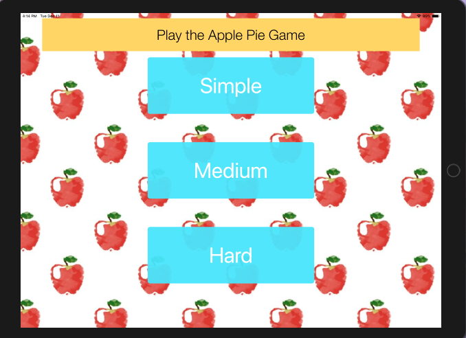

### Apple Pie Game 

De Apple pie app is een game die je woorden laat raden. Het werkt als een soort galgje. Je kiest voordat je begint de moeilijkheidsgraad van de woorde en vervolgens probeer je het woord te raden door het aanklikken van de juiste letters. De app houdt zelf bij hoe vaak je verloren en gewonnen hebt. 

#### Extra
Er is een mogelijkheid om voordat de game begint zelf de moeilijkheidsgraad van het spel te kiezen, de woordenlijst voor elke optie is anders. 

